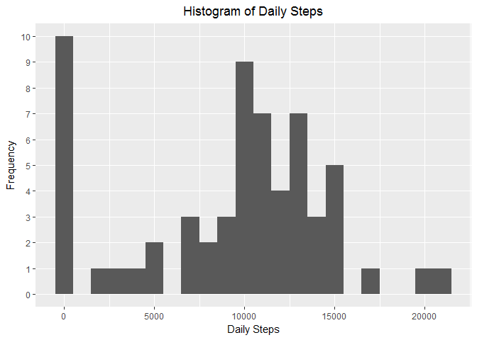
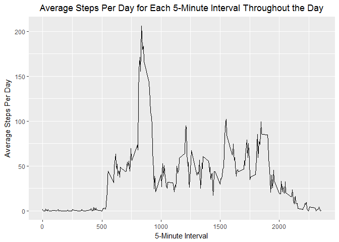
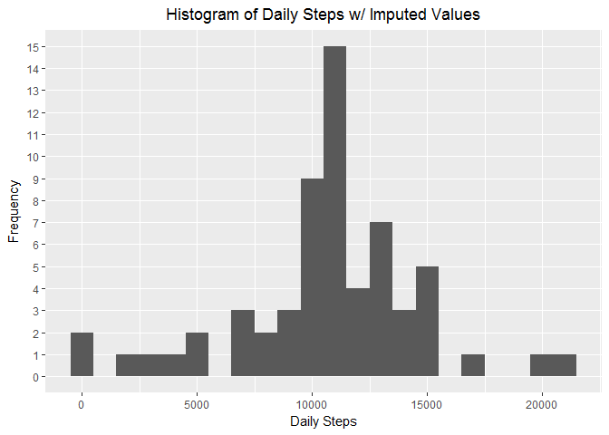
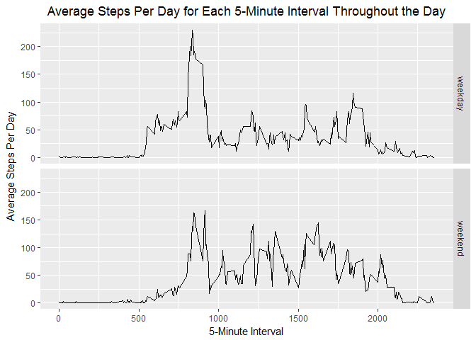

# Reproducible Research: Peer Assessment 1

## Loading the required libraries

```r
library(plyr)
library(dplyr)
library(ggplot2)
```


## Loading and preprocessing the data

```r
activity <- read.csv(unz('activity.zip', 'activity.csv'))
```

## What is mean total number of steps taken per day?

```r
daily_steps <- activity %>% group_by(date) %>% summarize(steps=sum(steps, na.rm=TRUE))
ggplot(subset(daily_steps, !is.na(steps)), aes(steps)) + 
  geom_histogram(binwidth = 1000) + 
  labs(x='Daily Steps', y='Frequency', title='Histogram of Daily Steps') + 
  scale_y_continuous(breaks=0:10, minor_breaks=NULL) +
  theme(plot.title = element_text(hjust=0.5))
```

<!-- -->

```r
mean_steps <- mean(daily_steps$steps, na.rm=TRUE)
median_steps <- median(daily_steps$steps, na.rm=TRUE)
```

The mean and median of the total number of steps taken per day are: 9354.2295082 and 10395, respectively.

## What is the average daily activity pattern?

```r
interval_steps <- activity %>% group_by(interval) %>% summarize(steps=mean(steps, na.rm=TRUE))
ggplot(interval_steps, aes(interval, steps)) + 
  geom_line() +
  labs(x='5-Minute Interval', 
       y='Average Steps Per Day', 
       title='Average Steps Per Day for Each 5-Minute Interval Throughout the Day') +
  theme(plot.title = element_text(hjust=0.5))
```

<!-- -->

```r
max_interval <- interval_steps$interval[which.max(interval_steps$steps)]
```

The 835th 5-minute interval contains the maximum number of steps on average.

## Imputing missing values

```r
na_intervals <- is.na(activity$steps)
num_na_intervals <- sum(na_intervals)
imputed_activity <- activity
imputed_activity$steps[which(na_intervals)] <- mapvalues(activity$interval[na_intervals], from=interval_steps$interval, to=interval_steps$steps)
imputed_daily_steps <- imputed_activity %>% group_by(date) %>% summarize(steps=sum(steps, na.rm=TRUE))
ggplot(subset(imputed_daily_steps, !is.na(steps)), aes(steps)) + 
  geom_histogram(binwidth = 1000) + 
  labs(x='Daily Steps', y='Frequency', title='Histogram of Daily Steps w/ Imputed Values') + 
  scale_y_continuous(breaks=0:15, minor_breaks=NULL) +
  theme(plot.title = element_text(hjust=0.5))
```

<!-- -->

```r
imputed_mean_steps <- mean(imputed_daily_steps$steps, na.rm=TRUE)
imputed_median_steps <- median(imputed_daily_steps$steps, na.rm=TRUE)
```

There are 2304 intervals with missing values. These values have been imputed using the mean number of steps for the particular intervals. After imputing, the histogram of total number of steps taken each day, as well as the mean and median total number of steps taken per day are drastically different. Zero total steps in a day is no longer the most common occurance, and the histogram now resembles a normal distribution. The mean and meadian total steps taken per day are now 1.0766189\times 10^{4} and 1.0766189\times 10^{4}, respectively. As a results of imputing missing data, estimates of the total daily number of steps is more believable (less days with 0 steps), but assumes that there are no non-normal days (perhaps the user ran a marathon on a day without data).

## Are there differences in activity patterns between weekdays and weekends?

```r
imputed_activity$weekday <- ifelse(weekdays(as.Date(imputed_activity$date)) %in% c('Saturday', 'Sunday'), 'weekend', 'weekday')
weekday_interval_steps <- imputed_activity %>% group_by(weekday, interval) %>% summarize(steps=mean(steps, na.rm=TRUE))
ggplot(weekday_interval_steps, aes(interval, steps)) + 
  facet_grid(weekday ~ .) +
  geom_line() +
  labs(x='5-Minute Interval', 
       y='Average Steps Per Day', 
       title='Average Steps Per Day for Each 5-Minute Interval Throughout the Day') +
  theme(plot.title = element_text(hjust=0.5))
```

<!-- -->
